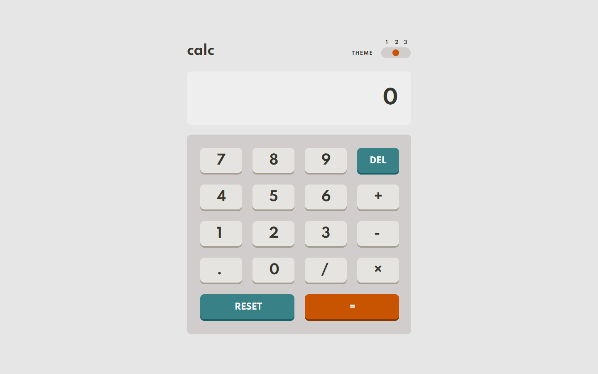

### Screenshot

### Links
- Solution URL: https://github.com/ZeynebKoc/calculator-app
- Live Site URL: https://stupefied-lovelace-f9c15d.netlify.app/

### Built with
- Semantic HTML5 markup
- CSS custom properties
- Flexbox
- CSS Grid
- Svelte 
- Javascript

### Useful resources
- https://svelte.dev/tutorial/basics - This helped me. I really liked this site and will use it going forward.

## Author
- Frontend Mentor - [@ZeynebKoc]https://www.frontendmentor.io/profile/ZeynebKoc/my-challenges

